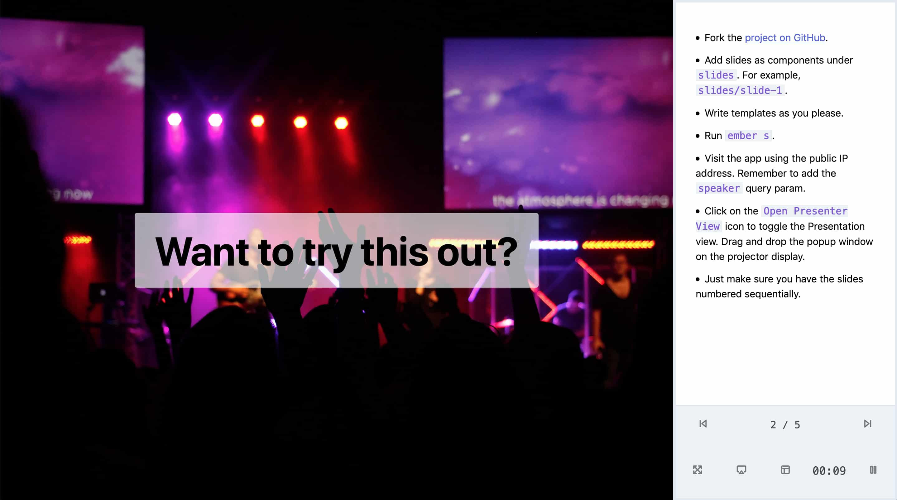

# ember-keynote

This was built as a demo for my talk on using WebSockets with Ember.
If you would like to use this, feel free to fork this repo and add
your slides as components.

## Features

* Create interactive EmberJS presentations.
* Sync your presentation across all screens.
* Speaker mode with notes, timer and previews of the next and previous slides.
* Export all slides as PDF.
* Write slides and notes in markdown.

## Prerequisites

You will need the following things properly installed on your computer.

* [Git](https://git-scm.com/)
* [Node.js](https://nodejs.org/) (with npm)
* [Ember CLI](https://ember-cli.com/)

## Installation

* `git clone <repository-url>` this repository
* `cd ember-keynote`
* `npm install`

## Running / Development

* `ember serve`
* For the speaker view, visit `publicip:4200/?speaker`.
* For the audience view, click on the `Open Presenter View icon` and drag the popup
  window to the screen that is being shared.
  
## Presenting

You can use the presenter view explained below or use your phone. To use your phone,
connect your laptop and phone to the same network and just use the slide controls on
your phone to automatically sync the slides across all audience devices.

### Usage

You can switch between the slides by making use of the `arrow keys`
or the `A` and `D` keys. You can also use the control buttons on the screen.

Use the Full Screen icon to toggle fullscreen view. This is also possible in the
audience view but you will have to hover on the bottom right corner to see
the toggle as it is hidden by default. I am open to improving the UX aspect of this.

If you pause the presentation, you will be able to navigate the slides but the
slides will remain frozen for the audience. It will get synced again when you
resume the presentation.

You can add slide notes by adding them to the respective slide component's class.

To export the presentation as a PDF, use the `download` query parameter. You can then
use the browser's `Save as PDF` feature to download the presentation. Please ensure
that the `Background graphics` option is checked.

### Deploying

This app makes use of WebSockets. You will have to deploy a Node.js
app that behaves similar to the middleware in `lib/slide-controller`
and configure the WebSocket server URL in this app.

Having said that, I guess just running `ember serve` should be sufficient
for what this app was designed to do.

## Further Reading / Useful Links

* [ember.js](https://emberjs.com/)
* [ember-cli](https://ember-cli.com/)
* Development Browser Extensions
  * [ember inspector for chrome](https://chrome.google.com/webstore/detail/ember-inspector/bmdblncegkenkacieihfhpjfppoconhi)
  * [ember inspector for firefox](https://addons.mozilla.org/en-US/firefox/addon/ember-inspector/)
